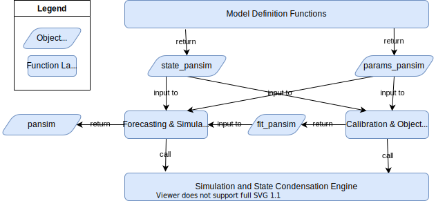
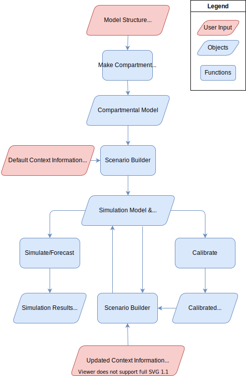

# Contributing to McMasterPandemic

Thank you for contributing to our project.

## Architecture

### Current Architecture

The simplified current architecture is described by the following diagram.



Each box is a layer of functions that call functions in the layers below them.

Model definition functions are used to create and manipulate parameter and state-variable objects that define model structure and defaults values.  These objects have S3 classes `params_pansim` and `state_pansim`.  Common functions in this layer are `read_params`, `make_state`, and `expand_state_vax`.

The forecasting and simulation functions allow one to ... `do_step`, `run_sim`, `forecast_sim`, and others that are typically not used by users (e.g. `run_sim_range`, ...)

### Target Architecture Proposal



### Engine-Client Separation

* Currently one client -- the R client -- and hopefully/probably we will only ever have one client
* Currently two engines
  * Original R
  * TMB


* Stuff that goes in the engine:
  * Indices
  * Simulation steps
  * Simulation output summarization (e.g. convolutions, differences)
  * Objective function computation
* Stuff that goes in the client:
  * Names
  * Names of states
  * Names of parameters (e.g. transmission rate)
  * Names of loss functions (e.g. negative binomial, gaussian)
  * Topology of flow among states

#### NOTES

* What about summary methods for parameters?
  * Use case -- compute R0/r/Gbar for an _ensemble_ of mcmc simulations of parameters
  * In general we might need a many-to-one relationship between parameter sets and compartmental models
* In general we need to think about ensembles, sampling from parameter distributions, importance sampling, mcmc, etc...


## Engines


## Maintaining C++ Code

We try to be disciplined in how we maintain the `C++` code, in that the correctness of this code can in principle be judged against [this specification document](https://canmod.net/misc/flex_specs).  These specifications are [versioned](https://canmod.net/misc/flex_specs#versioning-and-lifecycle) with the reference implementation for each version located in [inst/tmb](https://github.com/mac-theobio/McMasterPandemic/tree/tmb/inst/tmb). The currently recommended version is saved in [inst/tmb/recommended_spec_version](https://github.com/mac-theobio/McMasterPandemic/tree/tmb/inst/tmb/recommended_spec_version).

The package itself can only use one of these reference implementations at a time. The default spec version can be set by copying the appropriate versioned `cpp` file into `src/McMasterPandemic.cpp`, and this can be accomplished using the following [`make`](https://www.gnu.org/software/make/) rule.
```
make src/McMasterPandemic.cpp
```
This `make` rule copies the currently recommended version into `src/McMasterPandemic.cpp`.

One may also switch the spec version being used during an `R` session by using `set_spec_version` function. For example, if executed from the project root directory the following line will update the spec version and associated `C++` code being used.
```
set_spec_version('0.1.0', 'inst/tmb')
```
Note that this will also likely trigger compilation of the `C++` code unless the objects, shared objects, and/or DLLs can be found in the same directory as the associated `.cpp` file or some method of caching has been established.  One may find the spec version that they are using at any time with the following function.
```
spec_version()
```

On the `R` side one may also test for a particular spec version using the following family of functions: `spec_ver_eq`, `spec_ver_gt`, `spec_ver_lt`, `spec_ver_btwn`. Similarly, one may assert a certain spec version using the `spec_check` and `feature_check` functions.


## Comparing R and TMB Engines

TODO: describe global options, `tmb_mode`, `R_mode`, etc ...

TODO: describe `compare_*` family of functions ...on 


## The `flexmodel` Class

TODO: point to a help file (not yet written) that describes the `flexmodel` class

TODO: describe the `get_*` family of functions and how they should be used to create functions like `rate_summary`


## Global Options

To identify McMasterPandemic-specific global options on the `R` side we prefix their names with `MP_`. For example, the `MP_use_state_rounding` option is used to indicate whether the R engine should ever round the state variable. The defaults for all McMasterPandemic-specific options should be set in [R/zzz.R](https://github.com/mac-theobio/McMasterPandemic/blob/tmb/R/zzz.R).

## Package Tests


## Debugging

### TMB objective function returns NaN

There are several ways for the objective function to come back as a NaN. When this happens it can be used to run the simulate method within the TMB object. This simulate method might return a series of warnings, which can be useful for generating hypotheses about why the likelihood came out as a NaN. It can also be helpful in these cases to set `options(warn = 2)` so that warnings halt execution. By halting, one may inspect the parameters that were used during at the time of the warning, by looking in the `env$last.par` component within the TMB object.

See https://kaskr.github.io/adcomp/_book/Errors.html#floating-point-exception for another approach using GDB.  Unfortunately this doesn't appear to be available for mac os (related discussion: https://github.com/ArduPilot/ardupilot/issues/1941), so I prefer just using the simulate method.


## Types of `flexmodel`

* `flexmodel` used for simulations that are not guided by calibrations
* `flexmodel_to_calibrate` used to pass to an optimizer
* `flexmodel_calibrated` used to simulate from a calibrated model

## Parameters for TMB Objects

There are two functions that take a `flexmodel` and return a vector of parameters

Simulation functions are all driven by the `simulate` method of TMB objects. These functions have optional `sim_params` arguments, which should give a vector to pass to TMB simulate methods. If there are no `sim_params` provided by the user, the `tmb_params` function is used to attempt to guess.

`flexmodel` objects contain two parameter vectors: `params` and `tv_mult`


coef.flexmodel = function(
  object,
  vector = c("tmb_arg", "params", "tv_mult"),
  full = TRUE,
  optimized = FALSE,
  transformed = FALSE,
  ...
) {
  
}
default, opt_init, opt_final

## Testing Infrastructure

When one only wants to test the TMB refactored functionality, please use the following commands.

```
export MACPAN_TEST_LEVEL=1
make test-tmb-all
```

The test level can be increased to `>1` to run tests that are slower because they compare refactored TMB/C++ results with equivalent jobs that use the original R-engine.

It is also possible to only run tests associated with specific areas.

```
test-tmb 
test-tmb-forecast
test-tmb-struc                       
test-tmb-calibrate
test-tmb-make-state
test-tmb-timevar
```
## Adding to the sp Vector on the C++ Side

### Pass indices from R

```
DATA_IVECTOR(powidx);
DATA_IVECTOR(powarg1idx);
DATA_IVECTOR(powarg2idx);
```

### Compute the number of new elements in sp and allocate this space in sp and simulation_history

See the area of code with `sumSize` for example.

```
// more code ...

int powSize = powidx.size(); // powers

// more code ...

matrix<Type> simulation_history(numIterations+1, \
  stateSize+tvElementsNum+sumSize+factrSize+powSize+extraExprNum+lagNum+convNum);

// more code ...

vector<Type> sp(state.size()+params.size()+sumSize+factrSize+powSize);

// more code ...

vector<Type> place_holder_pow(powSize);
sp << state, params, place_holder, place_holder_factr, place_holder_pow;

// more code ...

if (powSize>0)
  simulation_history.block(0, stateSize+tvElementsNum+sumSize+factrSize, 1, powSize) = \
    sp.segment(stateSize+params.size()+sumSize+factrSize, powSize).transpose();

```

### Update `sp` handling in `update_state_functor` 

(similar to previous step)

```
template <class Type>
struct update_state_functor{
  // Data members
  vector<Type> params_;
  vector<int> from_;

// more code ...

  vector<int> powidx_;
  vector<int> powarg1idx_;
  vector<int> powarg2idx_;
  
// more code ...

// Constructor
  update_state_functor(
    vector<Type> params,
    vector<int> from,

// more code ...

    vector<int> powidx,
    vector<int> powarg1idx,
    vector<int> powarg2idx,

// more code ...

    int do_approx_hazard) : params_(params), from_(from), to_(to), count_(count),

// more code ...

                     powidx_(powidx),
                     powarg1idx_(powarg1idx),
                     powarg2idx_(powarg2idx),

// more code ...

    // Concatenate state and params
    vector<T> sp(state_.size()+params.size()+sumidx_.size()+factr_spi_.size()+powidx_.size());

// more code ...

    vector<T> place_holder_pow(powidx_.size());

    sp << state_, params, place_holder, place_holder_factr, place_holder_pow;
```


### Function to update `sp` such as `update_sum_in_sp`

```
template<class Type>
void update_pow_in_sp(
    vector<Type>& sp,
    const vector<int>& powidx,
    const vector<int>& powarg1idx,
    const vector<int>& powarg2idx
  )
{
  for (int j=0; j<powidx.size(); j++) {
    sp[powidx-1] = pow(sp[powarg1idx-1], [powarg2idx-1])
  }
}
```

### Use the update function in the objective function and in the `update_state_functor`

```
update_pow_in_sp(sp, powidx, powarg1idx, powarg2idx);
```

### Update the argument signature and calls to `do_make_state`


