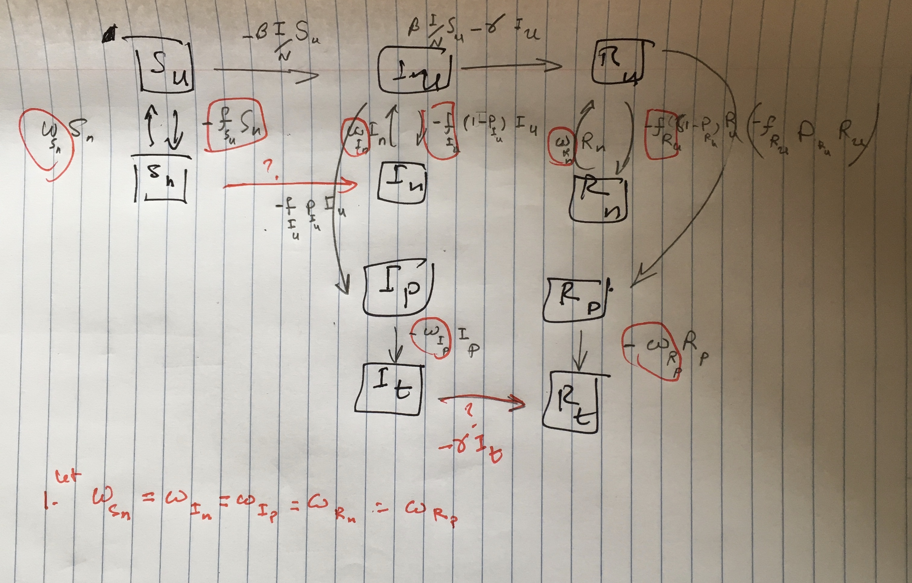

```{r setup, include=FALSE}
knitr::opts_chunk$set(echo = TRUE)
```

Notes on other references: (1) [testing_flow.md](testing_flow.md)(I am using the notation in this doc)

# On Math and Weighting

## Model and Definitions

- Assume there are 3 groups of individuals: $S$, $I$ and $R$.
- Each group splits into 4 subgroups to incorporate the testing mechanism, so overall the model framework has 12 compartments as follows. $S_u,$ $S_n$, $S_p$, $S_t$, $I_u$, $I_n$, $I_p$, $I_t$, $R_u$, $R_n$, $R_p$, $R_t$.
- Further, assume that (1) a perfectly specific test, i.e. no false positives, then $S_p$ and $S_t$ are always zero (2) there are two 'integrator' or 'accumulator' compartments, $N$ and $P$, to collect cumulative reported neg/pos tests. 

## Per Capita Rate of Flow from Untested to Positive or Negative Compartments

- $t$: testing intensity with dimensions of $1/time$.
- $\omega$: the rate of *onward flow* from the awaiting positive compartment, $p$, to reported/tested compartment, $t$, or from awaiting negative compartment, $n$, back to $u$.  It has units of $1/time$.

- Note: The complicated part is the flow rate from $Z_u$ to $Z_n$, $Z_p$.  The (total, not per capita) flow from $Z_u$ to $Z_n$ is $t (1-P_Z) F(W_Z) Z_u$, from $Z_u$ to $Z_p$ is $t P_Z F(W_Z) Z_u$. Where, $P_Z$ is the probability of positive test.  

- At the simplest $F(W_Z)=W_Z$.  The flows from $Z_n$ to $Z_u$ and $Z_p$ to $Z_t$ are $\omega Z_n$ and $\omega Z_p$ respectively. We are using a dimensionless scaling where $F(W_Z) = (W_Z \cdot N_0)/\sum_{Z'} \left( W_{Z'} {Z'}_{u} \right)$, i.e. the denominator is the sum of the product of the weights and the current occupancy of the untested compartments.

## Model




\begin{align}
1)\  d S_u/dt &= \omega S_n -\beta \frac{(I_u+\eta_1 I_n+\eta_1 I_p+ \eta_2 I_t)}{N_0} S_u - t (1-P_S) F(W_s) S_u \\
2)\ d S_n/dt &= t (1-P_S) F(W_S) S_u - \omega S_n - \beta \frac{(I_u+\eta_1 I_n+\eta_1 I_p+ \eta_2 I_t)}{N_0} S_n   \\
3)\ d I_u/dt &= \beta (I_u/N_0) (S_u+S_n) -t F(W_I) I_u + \omega I_n  - \gamma I_u  \\
4)\ d I_n/dt &= \beta (\eta_1 I_n/N_0) (S_u+S_n) +t (1-P_I) F(W_I) I_u - \omega I_n -\gamma I_n \\
5)\ d I_p/dt &= \beta (\eta_1 I_p/N_0) (S_u+S_n) + t P_I F(W_I) I_u - \omega I_p -\gamma I_p \\
6)\ d I_t/dt &= \beta (\eta_2 I_t/N_0) (S_u+S_n) + \omega I_p - \gamma I_t  \\
7)\ d R_u/dt &= \gamma I_u + \omega R_n - t F(W_R) R_u  \\
8)\ d R_n/dt &= \gamma I_n + t (1-P_R) F(W_R) R_u - \omega R_n  \\
9)\ d R_p/dt &= t P_R F(W_R) R_u + \gamma I_p - \omega R_p  \\
10)\ d R_t/dt &= \gamma I_t + \omega R_p  \\
11)\ dN/dt &= \omega (S_n + I_n + R_n)   \\
12)\ dP/dt &= \omega(I_p + R_p).
\end{align}

Where, $F(W_Z) = (W_Z \cdot N_0)/\sum_{Z'} \left( W_{Z'} {Z'}_{u} \right)$.
For convenience, let $F1=t*F(W_S), F2=t*F(W_I)$ and $F3=t*F(W_R)$ hereafter. 
$\eta$ is the isolation parameter with the assumption of $\eta_2<\eta_1$.

```{r packages, message=FALSE}
library(deSolve)
library(ggplot2)
library(tidyr)
library(McMasterPandemic)
unpack <- McMasterPandemic::unpack

```

```{r, model formulation}
sir.model <- function(time,state,params){
    unpack(as.list(c(state,params)))
  
    ## scaling the weights
    sc <- t*N0/(W_s*S_u+W_i*I_u+W_r*R_u)
    F1 <- sc*W_s
    F2 <- sc*W_i
    F3 <- sc*W_r

    dS_u.dt <- omega * S_n - beta * (I_u+eta1*(I_n+I_p)+eta2*I_t)/N0 * S_u - (1-P_s) * F1 * S_u
    dS_n.dt <- (1-P_s) * F1 * S_u - omega * S_n - beta * (I_u+eta1*(I_n+I_p)+eta2*I_t)/N0 * S_n
    dI_u.dt <- beta * (I_u/N0) * (S_u+S_n) + omega * I_n - F2 * I_u - gamma * I_u
    dI_n.dt <- (1-P_i) * F2 * I_u + beta * (eta1*I_n/N0) * (S_u+S_n) - omega * I_n - gamma * I_n
    dI_p.dt <- beta * (eta1*I_p/N0) * (S_u+S_n) + P_i * F2 * I_u - omega * I_p - gamma * I_p 
    dI_t.dt <- beta * (eta2*I_t/N0) * (S_u+S_n) + omega * I_p - gamma * I_t 
    dR_u.dt <- gamma * I_u + omega * R_n - F3 * R_u  
    dR_n.dt <- gamma * I_n + (1-P_r) * F3 * R_u - omega * R_n
    dR_p.dt <- P_r * F3 * R_u + gamma * I_p - omega * R_p
    dR_t.dt <- gamma * I_t + omega * R_p
    dN.dt <- omega * (S_n + I_n + R_n)
    dP.dt <- omega *(I_p + R_p)
    
    # return the rate of change
  dxdt <- c(dS_u.dt,dS_n.dt,dI_u.dt,dI_n.dt,dI_p.dt,dI_t.dt,dR_u.dt,dR_n.dt,dR_p.dt,dR_t.dt,dN.dt,dP.dt)
    ## }
    return(list(dxdt))
}

```

```{r model inputs, message=FALSE}
params <- c(N0=1000, beta=1,gamma=1/3, omega=0.25, t=0.01, 
             W_s=0.01, W_i=1, W_r=0.01, #weights
             P_s=0, P_i=0.5, P_r=0.5, #prob of waiting for being tested positive
            eta1=0.02, eta2=0.01 #isolation parameter   
            )

state_init <- c(S_u=params[["N0"]], S_n=0,
                I_u=1,I_n=0,I_p=0,I_t=0,
                R_u=0,R_n=0,R_p=0,R_t=0,
                N=0,P=0)

d <- seq(0,200,by=0.1)
# Conditional stop for desolver
rootfun <- function (time, state,params) { 
  unpack(as.list(c(state,params)))
  return(I_u - 1) }
```

Test gradient
```{r}
g1 <- sir.model(time=0,state=state_init, params=params)
all.equal(sum(g1[[1]]),0)
## debug(sir.model)
## g1 <- sir.model(time=0,state=state_init, params=params)
```


```{r model_run, message=FALSE}
out <- as.data.frame(
  ode(
    func=sir.model,
    y=state_init,
    times= d, 
    parms=params,
    rootfun = rootfun, 
    method="lsodar"
  )
)

out2 <- out %>%
  pivot_longer(c(S_u,S_n,I_u,I_n,I_p,I_t, R_u,R_n,R_p,R_t), names_to = "compartment", values_to = "value")

ggplot(data=out2, aes(x=time,y=value,col=compartment))+geom_line() +
  scale_y_log10(limits=c(0.1,params[["N0"]]))
    ```

## Steady States

There are two steady states for the above SIR model.

- $E1$: $S_u= S_u, S_n= \frac{(1-P_s) F1 }{\omega} S_u$, and $I_j=R_j=0 \ \forall j$.


### Basic Reproduction Number

The next generation matrix, $G = F V^{-1}$, is in the lower triangular form with $F$ and $G$ as follows.

\begin{equation}\label{FV}
F= \left[ \begin {array}{cccc} \beta&\gamma&0&0\\ 
 0&\beta\,\eta_{{1}}&0&0\\ 0&0&\beta\,\eta_{{1}}&0\\ 
 0&0&0&\beta\,\eta_{{2}}
 \end {array} \right], 
 V=
 \left[ \begin {array}{cccc}  F2+\gamma&-\omega&0&0\\
-\left( 1- P_I \right)  F2&\omega+\gamma&0&0\\ 
-P_I F2&0&\omega+\gamma&0\\ 
0&0&-\omega&\gamma 
\end {array} \right],
\end{equation}

\begin{equation}
G = \left[ \begin {array}{cc} 
G_{11}&0 \\
G_{21}&G_{22} 
\end {array} \right], \text{ where } \\
G_{11} =\frac{1}{\gamma(\omega+\gamma)+F2 (\gamma+\omega P_I)} 
\left[ \begin {array}{cc}
\beta (\omega+\gamma) + \gamma F2 (1-P_I) & \beta \omega + \gamma (1+F2)\\
\beta \eta_1 F2 (1-P_I) & \beta \eta_1 (F2 + \gamma)
\end {array} \right],
\\ 
G_{22} =
\left[ \begin {array}{cc}
\frac{\beta \eta_1}{\omega+\gamma} & 0\\
\frac{\beta \eta_2 \omega}{\gamma(\omega+\gamma)} & \frac{\beta \eta_2}{\gamma}.
\end {array} \right]
\end{equation}


```{r r0, message=F}
R0=params[["beta"]]*params[["eta2"]]/params[["gamma"]]
R0
```


