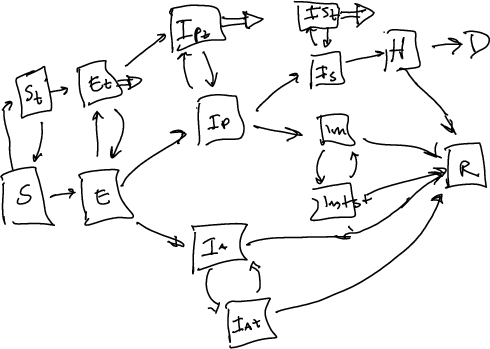

## notes on testing flow

We are modifying our basic model in order to be able to (1) make use of case reporting data (i.e., positive test confirmations per day) without having the results confounded by variation in testing intensity, and incorporate information on testing intensity/test positivity into our calibration; (2) allow scenario analysis of changes in testing intensity/contact tracing.

Our basic approach is to add an additional set of pre-infectious and infectious compartments to our model, paralleling the current set {S,E,I(asymptomatic),I(presymptomatic),I(mild),I(severe)}. For the pre-infectious compartments (S,E) we split the existing compartment into "untested" and "tested (awaiting results)" compartment. When a test is reported, individuals move back from the "tested" to the "untested" compartment, and a negative test is counted (we assume perfect test specificity for now, so S and E individuals always test negative). For infectious compartments (Is, Ip, Im, Ia), there is an additional "positive" compartment (we assume that individuals who have received a positive test will not be re-tested). Tested individuals move either to "positive" or "untested" (with probability based on test sensitivity), with the positive or negative test count incremeted accordingly.

  Individuals can also move between epidemiological compartments while awaiting test results, e.g. from "presymptomatic, awaiting test results" to "mild infection, awaiting test results".  This doesn't change their testing status, except under certain special cases:

* rather than allowing individuals to move from "exposed, awaiting tests" to an infectious compartment (Ip or Ia), we arbitrarily specify that their negative test result is reported at the time of transition (otherwise, we would either keep track of separate "asymptomatic, awaiting *negative* test results" and "presymptomatic, awaiting *negative* test results" categories, or we would have to allow these tests to be reported as positive).

* when individuals from positive categories recover or enter the hospital, we automatically resolve their test results. 

[It might make sense for all untested severe cases entering the hospital to automatically be tested and immediately receive results (i.e. positive or negative depending on sensitivity).

Hospitalized individuals are not tested. (These are a small fraction of the overall population in any case.)

At present we are assuming that recovered individuals are never tested. If we did institute testing for recovereds, we should consider including a "recovered but still virus-positive" category.

In order to reflect the range of possible testing strategies, we assign a "testing weight" to each compartment in the model that specifies what fraction of the current testing intensity is allocated to that compartment.  We take the current testing intensity T (overall per capita tests/day) as a model input. Then, given testing weights $w_i$, the rate at which individuals move from "untested" to "awaiting test results" is $T w_i/\sum(w_i)$.  (One of the weights can be set to 1 without loss of generality.) The weights depend on the testing strategy and population state in complicated ways; if only confirmatory testing is being done (no screening or contact tracing or surveillance testing), then the weights will be skewed toward symptomatic compartments - although obviously not entirely, as test positivity rarely goes above 20% even in disastrous situations, and we think that sensitivity is much higher than this. An increased emphasis on contact tracing will increase the testing weights in non-symptomatic (Ia/Ip), exposed (E), and susceptible compartments. (Weights would be equal for surveillance testing, i.e. random sampling of the population.)

Until now we have only used positive tests in our calibration. If we add negative tests we should be able to calibrate at least one weight parameter (e.g., set $w_i$ to 1 for all symptomatic classes and $w_i$ to $w$ for all negative and non-symptomatic classes {S, E, Ia, Ip}). It would be nice to calibrate two weight parameters - one for negative and one for positive but non-symptomatic - but it's not obvious that this will work.

## flow diagrams

## references

Tuite/Fisman/Greer models with testing flow?

Friston papers
